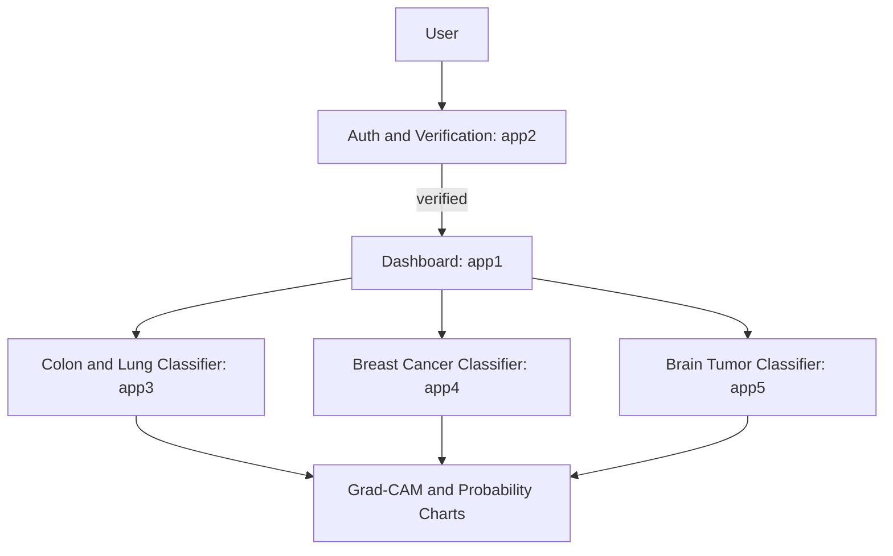

# Aura AI - AI Unified Radiology Assistant
## A Modular Flask-Based Web Application for AI-Powered Cancer Detection in Histopathology Images


## Introduction
Aura AI - Unified Radiology Assistant is a next-generation, AI-powered diagnostic support
system designed to assist pathologists, oncology researchers, and medical students in the rapid
preliminary assessment of histopathology images. Leveraging deep learning (PyTorch +
ResNet18) and explainable AI (Grad-CAM), Aura AI provides both accurate predictions and
transparent visual reasoning, offering insights into why the model makes a particular decision.

## Purpose
Aura AI is an advanced, user-centric histopathology analysis assistant built to support fast,
reliable, and explainable assessment of cancerous tissues. The system streamlines preliminary
diagnostic screening for two major cancer families, Breast Cancer and Lung and Colon Cancer,
while combining deep learning, pathology-aligned workflows, and explainable AI to create a
powerful tool for researchers, clinicians, and medical students.


| |
|:-:|
|  |


## Previous Works
Developed as a modular Flask application using the Application Factory + Blueprint pattern, the
platform is scalable, maintainable, and easily extendable with new cancer models or diagnostic
modules. Aura AI currently supports:

- Breast Cancer - IDC Detection (2-class)
- Lung and Colon Cancer - 5-class tissue classification

## Breast Cancer (App4 - Primary Module)
The breast cancer module serves as one of the platform's core diagnostic components. It
performs binary classification to differentiate between:

- IDC+ (Invasive Ductal Carcinoma Positive)
- IDC- (Invasive Ductal Carcinoma Negative)

Deep learning model: ResNet-18.

To enhance user understanding and diagnostic confidence, each prediction is paired with:

- Grad-CAM heatmaps that highlight regions most influential to the model's decision
- Clinical interpretation text that contextualizes the prediction
- Multi-image and batch processing, enabling users to screen multiple slides efficiently

This module is primarily designed for rapid IDC screening and educational visualization.

## Lung and Colon Cancer (App3)
The Lung and Colon module provides a 5-class tissue categorization to help distinguish between
malignant and benign cases across two organ systems:

- Lung Adenocarcinoma
- Lung Squamous Cell Carcinoma
- Lung Benign
- Colon Adenocarcinoma
- Colon Benign

Deep learning model: ResNet-18.

Each prediction is supported by visual analytics, including:

- Probability bar charts for intuitive comparison of model confidence across all classes
- Grad-CAM heatmaps that reveal high-impact tissue regions

This broader classification supports research use cases where tissue differentiation plays a
critical role.

## Explainable AI (XAI) Integration
Custom-built Grad-CAM implementation from scratch (no black-box models). Generates high
resolution, color-coded heatmaps superimposed on original microscopy images, enabling
medical professionals to understand and trust every prediction.

## Added Feature
Previously, we worked with lung and breast cancer histopathology images. We have now
transitioned to MRI data and developed a brain tumor classification model using ResNet-101.

## Model Training
This project presents a brain tumor classification system using MRI images, built on a ResNet-101
deep learning architecture with transfer learning and explainable AI. The model classifies MRI
scans into three categories: brain glioma, brain meningioma, and brain tumor, following a
carefully designed end-to-end pipeline including preprocessing, augmentation, training,
fine-tuning, and interpretation.

The backbone network is a pretrained ResNet-101 (ImageNet weights), chosen for its depth and
strong feature-extraction capability. The complete model contains 45.8 million parameters
(~174.8 MB). To balance performance and computational efficiency, only ~1.05 million
parameters (4.01 MB) were made trainable during the initial training phase, while ~42.66
million parameters (162.7 MB) remained frozen to preserve learned visual representations. An
additional ~2.10 million parameters (8.02 MB) were allocated to optimizer states during
training.

After convergence, selective fine-tuning of deeper convolutional layers further improved
performance, resulting in ~96% validation accuracy and ~94% test accuracy, with strong class
wise precision and recall.

To ensure transparency and trustworthiness, the system integrates a custom Grad-CAM
implementation, enabling visual explanation of model attention by highlighting MRI regions
most influential to each prediction.

For model training, we use Kaggle T4 GPU.

Note Book Link Brain Cancer - MRI CLASSIFICATION


| |
|:-:|
|  |

| |
|:-:|
|  |


## Back-end Implementation
The trained ResNet-101 brain tumor MRI model was integrated into the main Aura AI codebase
as a new, independent Flask Blueprint (app5). This module follows the same modular
architecture as existing cancer detection apps, with clearly separated routes, initialization, and
templates, ensuring consistency, scalability, and maintainability across the platform.

The model is loaded once at application startup and exposed through dedicated inference routes,
supporting MRI image upload, prediction, and explainable visualization. With this addition,
Aura AI now supports histopathology-based cancer analysis (lung, colon, breast) as well as
MRI-based brain tumor classification within a unified, production-ready system.

The entire application is Dockerized, enabling reproducible builds, environment isolation, and
seamless deployment across development and production environment.

## Updated Codebase
This is our updated project featuring a clean, dark-themed UI that classifies brain cancer from
user-uploaded MRI images, while displaying performance metric graphs and Grad-CAM
visualizations for model interpretability.

## Conclusion
Aura AI has evolved into a modular, production-oriented medical AI platform that demonstrates how
deep learning models can be responsibly designed, integrated, and explained within a real-world
system. What began as histopathology-based cancer analysis for lung, colon, and breast tissues has now
been successfully extended to MRI-based brain tumor classification using a ResNet-101 architecture,
highlighting the platform's flexibility and scalability.

The project combines parameter-efficient transfer learning, selective fine-tuning, and custom
explainable AI (Grad-CAM) to deliver high-performing models while maintaining transparency and
trust. With clear separation of concerns through Flask Blueprints, consistent UI design, and Dockerized
deployment, Aura AI moves beyond experimental notebooks into a deployable, maintainable
application.

By integrating multiple cancer detection pipelines, each with its own data modality, model, and
interpretability layer, Aura AI demonstrates a unified approach to medical image analysis that
balances performance, interpretability, and system design. While intended strictly for research and
educational use, the project serves as a strong technical foundation for future expansion into additional
imaging modalities, advanced reporting, and large-scale deployment.

Overall, Aura AI reflects a complete end-to-end workflow, from data and model development to UI,
explainability, and deployment, showcasing not only machine learning capability, but also engineering
discipline and product-level thinking.


## System Flow (Chart)


## Module Overview (Table)
| Module | Blueprint | Purpose | Key Outputs |
| --- | --- | --- | --- |
| Authentication | app2 | Signup, login, verification, email workflows | User session, verification status |
| Dashboard | app1 | Post-login landing page | Navigation to AI modules |
| Colon and Lung | app3 | 5-class tissue classification (ResNet-18) | Class label, confidence, Grad-CAM, bar chart |
| Breast Cancer | app4 | IDC positive or negative (ResNet-18) | Class label, confidence, Grad-CAM, plots |
| Brain Tumor | app5 | 3-class brain tumor classification (ResNet-101) | Class label, confidence, Grad-CAM, plots |
| Placeholder | app6 | Reserved route | Template page |
| Placeholder | app7 | Reserved route | Template page |

## Model Artifacts (Not Tracked in Git)
Large model files are intentionally ignored to stay within GitHub limits. Place them locally before running the app.

| Module | Expected File | Location |
| --- | --- | --- |
| app3 | resnet18_model_001.pth | app3/resnet18_model_001.pth |
| app4 | breast_cancer_cnn_model_updated.pth | app4/breast_cancer_cnn_model_updated.pth |
| app5 | brain_tumor_resnet101_finetuned_v00.3.keras | app5/brain_tumor_resnet101_finetuned_v00.3.keras |


## Project Structure
```bash
📦 Project Root
│
├── 📄 .dockerignore
├── 📄 .env
├── 📄 .gitignore
├── 📄 a.py
├── 📄 map.txt
├── 📄 README.md
├── 📄 requirements.txt
├── 📄 run.py
│
├── 📁 .vscode/
│
├── 📁 app1/
│   ├── 📄 routes.py
│   ├── 📄 __init__.py
│   ├── 📁 static/
│   │   └── 📁 css/
│   │       └── 🎨 style.css
│   └── 📁 templates/
│       └── 📄 home.html
│
├── 📁 app2/
│   ├── 📄 models.py
│   ├── 📄 routes.py
│   ├── 📄 __init__.py
│   └── 📁 templates/
│       ├── 📄 login.html
│       ├── 📄 signup.html
│       └── 📄 verify.html
│
├── 📁 app3/
│   ├── 📄 resnet18_model_001.pth
│   ├── 📄 routes.py
│   ├── 📄 __init__.py
│   ├── 📁 instance/
│   │   ├── 🖼️ bar_91e9a46c448542c5a7cb2b4f0f5cffae.png
│   │   ├── 🖼️ original_77c6cb17cd8649cc99aaea3f1478b804.png
│   │   ├── 🖼️ overlay_172d939aaa154746b24366d384c72e98.png
│   │   └── 🖼️ processed_12b20279ba844346becc9ad5812b714d.png
│   ├── 📁 static/
│   │   ├── 📁 css/
│   │   │   └── 🎨 style.css
│   │   └── 📁 js/
│   └── 📁 templates/
│       └── 📄 home2.html
│
├── 📁 app4/
│   ├── 📄 breast_cancer_cnn_model_updated.pth
│   ├── 📄 routes.py
│   ├── 📄 __init__.py
│   ├── 📁 instance/
│   │   ├── 🖼️ image_plot_503591f523f749dcaadb76aad300460a.png
│   │   └── 🖼️ prob_plot_a87119caab16478fa84b48907e6668f1.png
│   ├── 📁 static/
│   │   ├── 📁 css/
│   │   │   └── 🎨 style.css
│   │   ├── 📁 examples/
│   │   │   ├── 🖼️ example0.png
│   │   │   └── 🖼️ example1.png
│   │   ├── 📁 js/
│   │   │   └── ⚙️ script.js
│   │   └── 📁 uploads/
│   └── 📁 templates/
│       └── 📄 home3.html
│
├── 📁 app5/
│   ├── 📄 brain_tumor_resnet101_finetuned_v00.3.keras
│   ├── 📄 routes.py
│   ├── 📄 __init__.py
│   ├── 📁 instance/
│   │   └── 📁 result images/
│   ├── 📁 static/
│   │   ├── 🖼️ aura-favicon.svg
│   │   ├── 🖼️ Gemini_Generated_Image_dfmlzzdfmlzzdfml.png
│   │   └── 📁 css/
│   │       └── 🎨 style.css
│   └── 📁 templates/
│       └── 📄 home4.html
│
├── 📁 app6/
│   ├── 📄 routes.py
│   ├── 📄 __init__.py
│   └── 📁 templates/
│       └── 📄 home6.html
│
├── 📁 app7/
│   ├── 📄 routes.py
│   ├── 📄 __init__.py
│   └── 📁 templates/
│       └── 📄 home7.html
│
├── 📁 docker/
│   ├── 📄 docker-compose.yml
│   ├── 📄 Dockerfile
│   └── 📄 entrypoint.sh
│
├── 📁 docs/
│   └── 📄 Documentation.pdf
│
├── 📁 huggingface_cache/
│   ├── 📄 brain_tumor_resnet101_finetuned_v00.3.keras
│   ├── 📁 .locks/
│   │   └── 📁 spaces--say89--BrainTumour90MNH6602/
│   └── 📁 spaces--say89--BrainTumour90MNH6602/
│       ├── 📁 blobs/
│       │   └── 📄 aa070adf0f6a525bcd790b2aa3e395ab6330618556f14680c708a5e4c5610e32
│       ├── 📁 refs/
│       │   └── 📄 main
│       └── 📁 snapshots/
│           └── 📁 39fd1f85e30c3b9198e2895373e052f8de516b9a/
│               └── 📄 brain_tumor_resnet101_finetuned_v00.3.keras
│
├── 📁 huggingface_space/
│
├── 📁 images/
│   └── 📁 test data images/
│
├── 📁 instance/
│   └── 📄 aura.db
│
└── 📁 static/
    └── 📁 uploads/
        └── 📁 images/

```
## Environment Variables
Set these in a .env file:
- SECRET_KEY
- MAIL_USERNAME
- MAIL_PASSWORD
- MAIL_DEFAULT_SENDER
- FLASK_DEBUG (optional; default is on)

## Local Setup
1. Create a virtual environment.
2. Install dependencies: `pip install -r requirements.txt`
3. Add model files to their expected locations.
4. Create a .env file with the variables above.

## Run
- `python run.py`
- Open the app and follow the login workflow.

## Notes and Limitations
- Inference is CPU or GPU depending on the local environment.
- Model outputs are assistive and not a medical diagnosis.
- Maximum upload size is 10 MB per image.

## Project Structure Snapshot
- app1: dashboard
- app2: authentication and email verification
- app3: colon and lung classifier with Grad-CAM
- app4: breast cancer classifier with Grad-CAM
- app5: brain tumor classifier with Grad-CAM
- app6, app7: reserved modules

## Setup and Execution Commands
```bash
python -m venv .venv
.venv\Scripts\activate
pip install -r requirements.txt
python run.py
```

## Render Deployment (Free Tier, Web Service)
1. Create a new Web Service from this repo.
2. Runtime: Python 3.10.
3. Build Command:
    - `pip install -r requirements.txt`
4. Start Command:
    - `python run.py`
5. Environment Variables:
    - `SECRET_KEY`
    - `MAIL_USERNAME`
    - `MAIL_PASSWORD`
    - `MAIL_DEFAULT_SENDER`
    - `HF_APP5_REPO=say89/BrainTumour90MNH6602`
    - `HF_APP5_REPO_TYPE=space`
    - `HF_APP5_FILE=brain_tumor_resnet101_finetuned_v00.3.keras`
    - `HF_TOKEN` (required for private or gated repos)
    - `HF_CACHE_DIR=/tmp/huggingface_cache`

Free tier uses ephemeral storage. The model will re-download on each deploy or restart. If you upgrade to a persistent disk, set `HF_CACHE_DIR` to the mounted path (for example `/var/data/huggingface_cache`).


