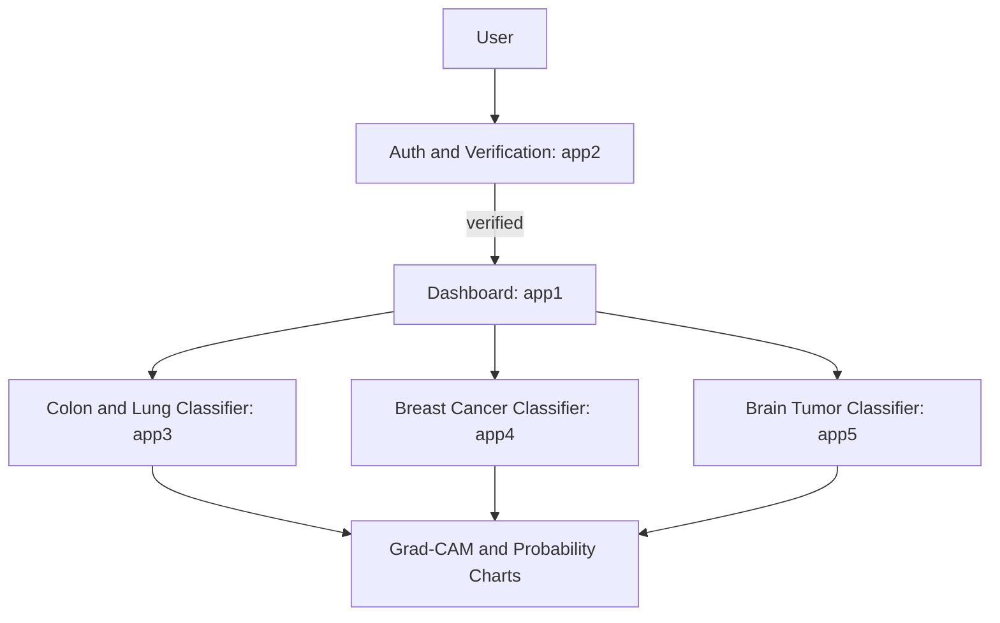

# AURA AI - Cancer Detection Suite

## Executive Summary
AURA AI is a multi-module Flask web application for AI-assisted radiology workflows. It provides secure user onboarding, a dashboard landing area, and three model-driven inference modules for colon and lung tissue classification, breast cancer detection, and brain tumor classification. Each module accepts image uploads, runs inference, and returns confidence charts plus Grad-CAM visualizations to support explainability.

## Key Features
- User authentication with email verification and welcome messaging.
- Central dashboard with routed access to each AI module.
- Image upload, preprocessing, and inference with per-class confidence. 
- Grad-CAM overlays and probability charts for interpretability.
- Modular Flask blueprints for easy extension.

## System Flow (Chart)

## Module Overview (Table)
| Module | Blueprint | Purpose | Key Outputs |
| --- | --- | --- | --- |
| Authentication | app2 | Signup, login, verification, email workflows | User session, verification status |
| Dashboard | app1 | Post-login landing page | Navigation to AI modules |
| Colon and Lung | app3 | 5-class tissue classification (ResNet-18) | Class label, confidence, Grad-CAM, bar chart |
| Breast Cancer | app4 | IDC positive or negative (ResNet-18) | Class label, confidence, Grad-CAM, plots |
| Brain Tumor | app5 | 3-class brain tumor classification (ResNet-101) | Class label, confidence, Grad-CAM, plots |
| Placeholder | app6 | Reserved route | Template page |
| Placeholder | app7 | Reserved route | Template page |

## Model Artifacts (Not Tracked in Git)
Large model files are intentionally ignored to stay within GitHub limits. Place them locally before running the app.

| Module | Expected File | Location |
| --- | --- | --- |
| app3 | resnet18_model_001.pth | app3/resnet18_model_001.pth |
| app4 | breast_cancer_cnn_model_updated.pth | app4/breast_cancer_cnn_model_updated.pth |
| app5 | brain_tumor_resnet101_finetuned_v00.3.keras | app5/brain_tumor_resnet101_finetuned_v00.3.keras |

## Environment Variables
Set these in a .env file:
- SECRET_KEY
- MAIL_USERNAME
- MAIL_PASSWORD
- MAIL_DEFAULT_SENDER
- FLASK_DEBUG (optional; default is on)

## Local Setup
1. Create a virtual environment.
2. Install dependencies: `pip install -r requirements.txt`
3. Add model files to their expected locations.
4. Create a .env file with the variables above.

## Run
- `python run.py`
- Open the app and follow the login workflow.

## Notes and Limitations
- Inference is CPU or GPU depending on the local environment.
- Model outputs are assistive and not a medical diagnosis.
- Maximum upload size is 10 MB per image.

## Project Structure Snapshot
- app1: dashboard
- app2: authentication and email verification
- app3: colon and lung classifier with Grad-CAM
- app4: breast cancer classifier with Grad-CAM
- app5: brain tumor classifier with Grad-CAM
- app6, app7: reserved modules

